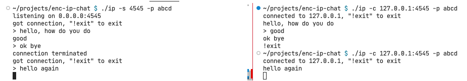

# enc-tcp-chat

AES-128 encrypted TCP chat



## dependencies

- openssl
- a c compiler

## usage

tell your friend to download and compile this, verbally agree on a password, and chat away

**server**

```bash
./ip -s 4545 -p my_secure_password123
```

**client**

```bash
./ip -c 192.168.0.3:4545 -p my_secure_password123
```

## todo

- streaming aes(?)
- long-running password with emphemeral salts(?)
- basically implement tls(?)
